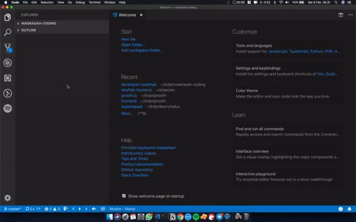

# Madrasah Coding - Angkatan 1

- [Madrasah Coding - Angkatan 1](#madrasah-coding---angkatan-1)
  - [Task for Section 1](#task-for-section-1)
  - [Section 1 - Why become developer & Basic HTML](#section-1---why-become-developer--basic-html)

:bulb: one section / week

## Task for Section 1

Before our first meet, please install these in your device:

- [ ] VS Code [Download Here](https://code.visualstudio.com/Download)
- [ ] VS Code extensions
  - [ ] Live Server https://marketplace.visualstudio.com/items?itemName=ritwickdey.LiveServer
- [ ] Browser: Chrome or Firefox.

How to Install VS Code extensions

:bulb: If you have small RAM, you can use firefox quantum
[download here](https://www.mozilla.org/id/firefox/)

## Section 1 - Why become developer & Basic HTML

Content:

Slide Why become developer: [open here](https://docs.google.com/presentation/d/1JdIY2TV5jlC_nA2XBLxJa6lXU9f0OwNewwvqZJ6PCnU/edit?usp=sharing)

Basic HTML: see folder section-1

Task:

1. Create 4 CV in HTML (don't copy paste) and use different format/template. Use table for each CV [click here](https://www.w3schools.com/html/html_tables.asp)
2. Learn about style in HTML and apply to CV that you create. [click here](https://www.w3schools.com/html/html_styles.asp)
3. Download Bootstrap 3.4.0 [Download Here](https://github.com/twbs/bootstrap/releases/download/v3.4.0/bootstrap-3.4.0-dist.zip)
